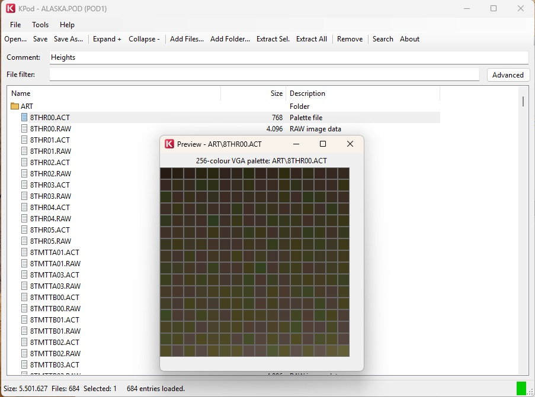

# KPod

[](#requirements)
[](#building-from-source)
[](#requirements)
[](LICENSE)

**Terminal Reality POD archive utility for Windows.**

KPod opens, browses, previews, extracts and builds the `POD` archives used by
*Monster Truck Madness 1 & 2*, *CART Precision Racing*, *Hellbender*, *Terminal
Velocity*, *Fury3* and their relatives. It reads and writes both the classic POD1
directory and the Community Patch 3 **POD1-64** extension with 64-byte entry
names. It also reads and explicitly authors `POD2`; `EPD` remains read-only.

It is the Windows-native port of
[JPod](https://github.com/juanputrerasm/JPod), the Java 17 original, and matches
it byte for byte: the same archives, the same `.inf` and `.lst` reports, the same
format names.



*Browsing `ALASKA.POD` with the 256-colour VGA palette of `ART\8THR00.ACT`
shown as a swatch grid.*

---

## Supported formats

| Format | Games | Support |
|---|---|---|
| `POD1` | MTM 1 & 2, CPR, Hellbender, Terminal Velocity, Fury3 | browse, preview, extract, save |
| `POD1-64` (Extended POD1) | Community Patch 3 content | browse, preview, extract, save |
| `POD2` | Nocturne, 4x4 Evo 1 & 2 | browse, preview, extract, explicit save/conversion, CRC, timestamp and audit history |
| `EPD` | Fly! | browse, preview, extract |

There is no POD3+ authoring.

---

## Features

### Archive viewing
- Open `.pod` and `.epd` archives and browse them in a file-viewer style list with
  Name / Size / Description columns.
- Folders and subfolders are shown with icons and start collapsed, so root files
  and top-level folders are easy to scan.
- Click a column header to sort by name, size or description; click again to
  reverse it, and a third time to return to archive order.
- The filter box narrows the list as you type, and it overrides collapse so a
  match is never hidden. The Advanced button opens a search dialog that jumps the
  list to a result.
- The 80-character archive comment is editable below the toolbar.
- The 10 most recently opened files are remembered in
  `%APPDATA%\KPod\config.json`.

### Extraction
- **Extract All** writes every entry to a folder, recreating the archive's
  subfolder structure.
- **Extract Sel.** extracts the selection, with an option to preserve or flatten
  the folder structure. Selecting a folder heading selects everything under it.

### Building and editing
- **New Archive** starts an empty archive.
- **Open Response List File** loads the existing `.lst` syntax or a PODTool-style
  `.rsp` with `podFilename:`, `volumeName:`, `//` comments and relative paths.
- **Add Files / Add Folder** appends files or recursively imports a directory.
- **Folder editing** creates folders, renames file or folder trees, and moves
  selections by command or internal drag and drop while preserving case and order.
- **Remove** deletes the selection.
- **Replace with File** swaps one entry's data, keeping its archive name.
- **Validate Archive** checks limits, field capacity, unsafe and duplicate paths,
  payload ranges, RAW palette records, checksums and the expected output layout.
- **Save / Save As** saves a named archive or writes a copy. POD1 is the default;
  POD2 is an explicit target and the actual output format is shown before writing.

### Reports
- **Save .inf** exports the fixed-column report: file name, total size, entry
  count, comment, and a padded name / size / offset table.
- **Save .lst** exports a plain entry-name list, ready to feed back into the
  response-list loader.

### File preview
Double-click any entry, or use Preview from the right-click menu:

| Extension | Preview |
|---|---|
| `.raw`, `.clr` | 8-bit paletted image decoded with the matched `.act` palette. Art textures (64x64) are drawn at 4x with no smoothing. A non-standard size opens a dialog for width, height and palette. |
| `.act` | 16x16 colour swatch grid; hovering a swatch reports its index and hex value. |
| `.wav` | Audio player with play, pause, stop and a millisecond position readout. |
| `.bmp`, `.png`, `.jpg`, ... | Standard images through GDI+. |
| `.txt`, `.def`, `.nav`, `.lvl`, `.sit`, `.lst`, `.ini`, `.cfg`, `.tex`, `.tnl`, `.ttx`, `.trk`, `.trn`, `.ndx` and other text formats | Scrollable monospaced text. |
| anything else | Hex dump of the first 4 096 bytes. |

#### Palette resolution
For `.raw` and `.clr` entries the palette is resolved in this order:

1. the palette recorded in the entry's own POD directory field (see below)
2. the same base name with an `.act` extension, in the same archive directory
3. any other `.act` in that directory
4. `VGA.ACT` anywhere in the archive
5. `METALCR2.ACT` anywhere in the archive (the MTM1 default)
6. the bundled `metalcr2.act`
7. greyscale

Step 1 is the one that matters for MTM1, Terminal Velocity, Fury3 and Hellbender.
Their packer stored the palette each RAW was authored against in the spare bytes
of the entry's name field, and it is not derivable from the file name: on those
games' main archives the old step-2-onward guess picks the wrong palette for 8 221
of 8 224 RAW entries, because it takes whichever `.ACT` happens to come first in
the archive. MTM2, CPR and community archives carry no such record and fall
straight through to the name-based rules. [`docs/POD_FORMAT.md`](docs/POD_FORMAT.md)
specifies it in full.

When a RAW payload is not one of the recognized sizes, the preview dialog offers
the exact width and height pairs that match the byte count, a swap button, and
every palette in the archive. The three common screen sizes are preselected:

- `64000` bytes: `320 x 200`
- `256000` bytes: `640 x 400`
- `307200` bytes: `640 x 480`

### Mount in pod.ini
Adds the open archive to the game's `pod.ini` mount list. KPod treats 99 as the
recommended limit, warns when the list is already that long, and still mounts the
POD rather than blocking. It searches the archive's folder and its parent, and
refuses to mount the same POD twice.

---

## POD1-64 (Extended POD1)

POD1-64 is the Community Patch 3 long-name extension. It is not a 64-bit archive
format and it is not EPD: the 64 refers only to the widened directory name field.

| Property | Classic POD1 | POD1-64 |
|---|---:|---:|
| Header | 84 bytes | 84 bytes |
| Directory name field | 32 bytes | 64 bytes |
| Longest name | 31 bytes | 63 bytes |
| Directory record | 40 bytes | 72 bytes |
| Directory entry `i` starts at | `84 + i * 40` | `84 + i * 72` |

POD1 has no magic value, so KPod detects the layout by validating it. The classic
40-byte directory is tried first and accepted only when every record decodes to a
plausible non-empty path whose byte range lies inside the file; the 72-byte layout
is tried only if the classic table fails. That ordering keeps an ordinary archive
from being reported as extended. The title bar shows `Extended POD1` when the
wider directory was used.

For a new archive, KPod emits classic POD1 whenever every complete directory field
fits and promotes to POD1-64 only when a path or embedded RAW palette record needs
the wider field. An opened POD1-64 archive stays extended. The complete record,
including both strings and their terminators, must fit; otherwise saving is rejected
instead of truncating metadata. The actual output format is confirmed before writing.

The upstream engine notes describe production extended archives as carrying a
version-tagged header, but the contract that would define the tag has never been
published. KPod, JPod, JSPod and JSTruckViewer all implement the untagged
84-byte-header interpretation and validate it structurally.

---

## Requirements

Windows, and nothing else. KPod runs on .NET Framework 4.8, which is part of
Windows 10 (from the April 2018 update) and Windows 11, so there is nothing to
install. It also runs on Windows 7 SP1 and 8.1 if 4.8 is present.

A second build targeting .NET 10 is published for anyone who prefers it. That one
needs the [.NET 10 Desktop Runtime](https://dotnet.microsoft.com/download/dotnet/10.0).
The two are identical in behaviour; pick whichever suits the machine.

---

## Getting started

Prebuilt binaries are on the
[Releases](https://github.com/juanputrerasm/KPod/releases) page. Download
`KPod.exe` and run it. No installer, no dependencies, one file. The .NET
Framework 4.8 build is the one to take unless you specifically want the .NET 10
build, which is published alongside it.

1. **Open...**, or drag a `.pod` onto the exe, or pass a path on the command line.
2. Double-click a folder row to expand it, or use **Expand +** to open everything.
3. Double-click a file to preview it.
4. Select entries and press **Extract Sel.**, or **Extract All** for the lot.

> [!NOTE]
> The executable is unsigned, so Windows SmartScreen will warn on first run.
> Choose *More info* then *Run anyway*. If you copied the file from another
> machine you may also need `Unblock-File .\KPod.exe` in PowerShell.

---

## Usage

### Toolbar

| Control | Action |
|---|---|
| **Open...** | Open a POD or EPD archive |
| **Save As...** | Write the current entry list to a new `.pod` |
| **Expand +** / **Collapse -** | Open or close every folder |
| **Add Files...** | Append files from disk |
| **Extract Sel.** / **Extract All** | Extract the selection, or everything |
| **Remove** | Drop the selected entries from the list |
| **Search** | Open the search dialog |

### Menus

- **File**: Open POD, New Archive, Open Response List File, Open Recent, Add
  Files, Remove Selected, Save As, Extract All, Extract Selected, Save .inf
  Report, Save .lst List, Exit
- **Tools**: Mount in pod.ini, Search
- **Help**: About

### Status bar

`Size` is what the archive would occupy if saved now, which is why it changes as
entries are added and removed, and why it grows by 32 bytes per entry the moment a
name forces the POD1-64 directory. `Files` and `Selected` are counts, `unsaved`
appears once the list differs from what is on disk, and the square at the right
edge turns red while an operation is running.

---

## Building from source

Building needs the [.NET 10 SDK](https://dotnet.microsoft.com/download/dotnet/10.0),
which compiles both targets. Running the result needs only what the table above
says.

```sh
dotnet restore KPod.slnx
dotnet build   KPod.slnx          # builds net48 and net10.0 together
dotnet test    KPod.slnx -f net10.0
```

All three work on macOS and Linux as well as Windows. `KPod.Windows` sets
`EnableWindowsTargeting`, so the WinForms project compiles anywhere even though it
only runs on Windows. The test project also targets `net48`, but running that leg
needs a Windows machine or Mono; `-f net10.0` is the portable way to run the suite.
To run the app on Windows:

```sh
dotnet run --project KPod.Windows -f net48
```

Release builds:

```sh
# .NET Framework 4.8, the main download
dotnet publish KPod.Windows -c Release -f net48 -p:DebugType=none

# .NET 10, the alternative
dotnet publish KPod.Windows -c Release -f net10.0-windows -r win-x64 \
  --self-contained false -p:PublishSingleFile=true -p:DebugType=none
```

Both produce a single executable. The Framework build compiles `KPod.Core`
straight into the exe, since .NET Framework has no single-file publish.

### Writing for both targets

Almost all of the code is shared, with one `#if` for WinForms startup and one for
a folder-dialog property. Where .NET Framework lacks something, `KPod.Core/Compat`
supplies it rather than the calling code branching: `Index`, `Range`, records
support, path helpers, Latin-1 lookup, JSON, and Java-compatible trimming. Neither
target pulls in a NuGet package, which is what keeps both builds to one file.

### Project layout

| Project | Target | Purpose |
|---|---|---|
| `KPod.Core` | `net48`, `net10.0` | Archive reading and writing, image and palette decoding, reports, manifests, `pod.ini`, preferences, and the folder-browser model. No Windows API, so it runs anywhere |
| `KPod.Windows` | `net48`, `net10.0-windows` | WinForms UI, plus the Windows-only pieces under `Platform/` (MCI audio) |
| `KPod.Tests` | `net48`, `net10.0` | xUnit tests for `KPod.Core`. 112 tests, runnable on any OS |

`KPod.Core` must never reference `System.Drawing` or `System.Windows.Forms`. The
RAW decoder returns `int[]` pixels and only `KPod.Windows` turns them into a
`Bitmap`; that one rule is what keeps the test suite portable.

### Regenerating the icon

`KPod.Windows/Assets/build-icon.sh` rebuilds `KPod.ico` from the two SVGs using
stock macOS tools. The full artwork is used at 48px and above; the small entries
use the K-only variant, because the slabs turn to mush below 32px.

---

## Format specification

[`docs/POD_FORMAT.md`](docs/POD_FORMAT.md) specifies the whole POD family: classic
POD1, the POD1-64 long-name extension, POD2 and EPD. It covers the palette record
the early Terminal Reality packer stored in the spare bytes of each RAW entry's
name field, which is documented nowhere else, and it marks every claim as verified
against shipped archives, documented upstream, implemented but unconfirmed, or
unresolved. [`docs/pod-format.json`](docs/pod-format.json) carries the same
structures as machine-readable data.

## References

- [JPod](https://github.com/juanputrerasm/JPod) - the Java 17 original
- [KPodman](https://github.com/juanputrerasm/KPodman) - the POD mounting utility
  this shares its build with
- [MTM2 Engine Content Limits](https://www.mtm2.com/~mtmg/misc/ENGINE_LIMITS.md)
- [EPD Format Reference](https://github.com/jopadan/termpod/wiki/EPD-Format-Reference)
- [Pod 2 Format Reference](https://github.com/jopadan/termpod/wiki/Pod-2-Format-Reference)

---

## Credits

Developed by **Juan Pablo Utreras** for the Monster Truck Madness Guild.

Based on the original WinPod by MDMRE.

Licensed under the [Apache License 2.0](LICENSE).

Monster Truck Madness, Terminal Velocity, Fury3, Hellbender, CPR, Nocturne and
4x4 Evo are trademarks of their respective owners. This is an unofficial,
community-made utility with no affiliation to Microsoft or Terminal Reality.